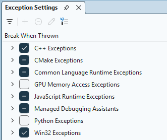
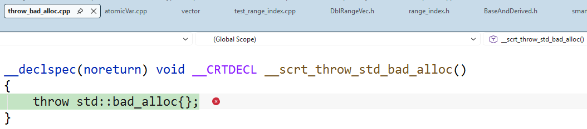
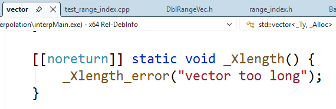

# "bad allocation" or "vector too long" with Containers as Template Parameter in unique_ptr
    random exceptions in C++20 of Visual Studio 2026

My algorithms for mathematical interpolation are defined as `template <typename Container>` classes. The actual instance is created as `unique_ptr` via a factory. Some of the header files are in [C++](C++).

With C++20 in Visual Studio 2026, the compiled executable works sometimes but **crashes** randomly, with exceptions such as **bad allocation** or **vector too long**. These are mysterious exceptions, beyond what you can find on Google.

By **turning on breaks with C++ exception**:
> Debug -> Windows -> Exception Setting

as follows:

I was able to locate the codes that throw, 

With the call stacks for [std::bad_alloc](xcp/bad_alloc.txt) and [std::length_error](xcp/length_error.txt), I see exceptions arising from the entire `vector` as the template parameter of the `NPointInterp` constructor within `make_unique`.

Looks like `NPointInterp` was trying to initiate `vector<double>` but failed. But why the initiation fails is not clear to me. Therefore, it is reported here.